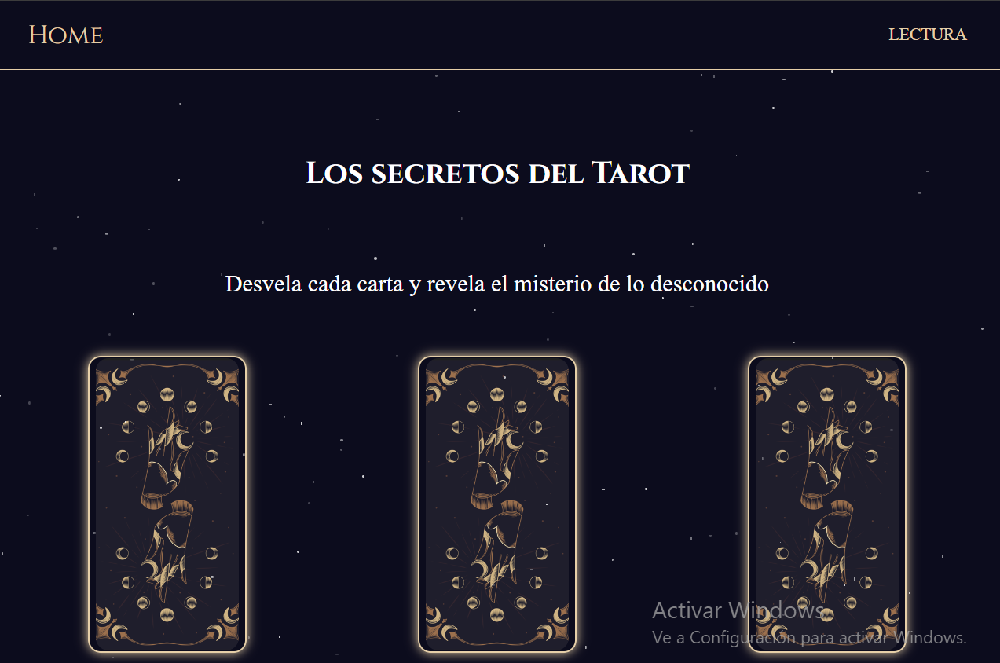
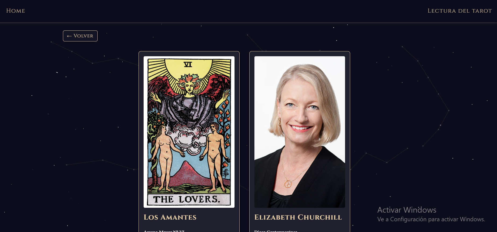
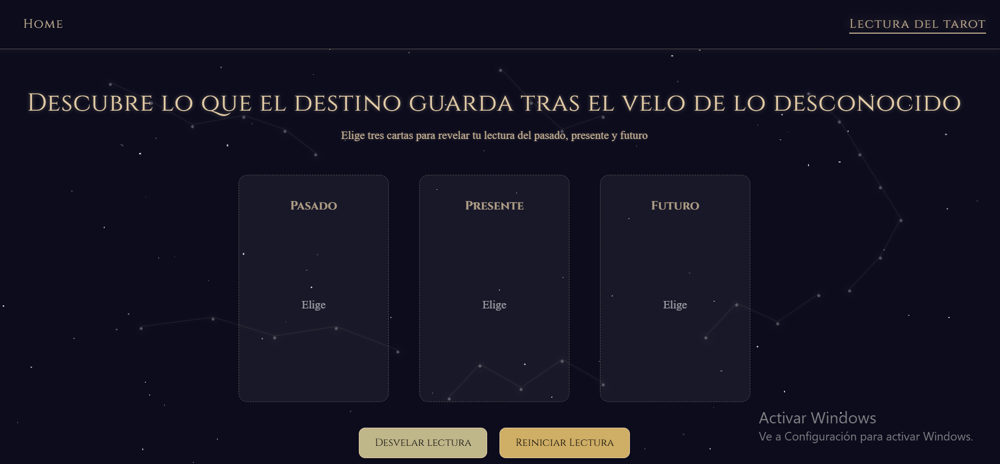
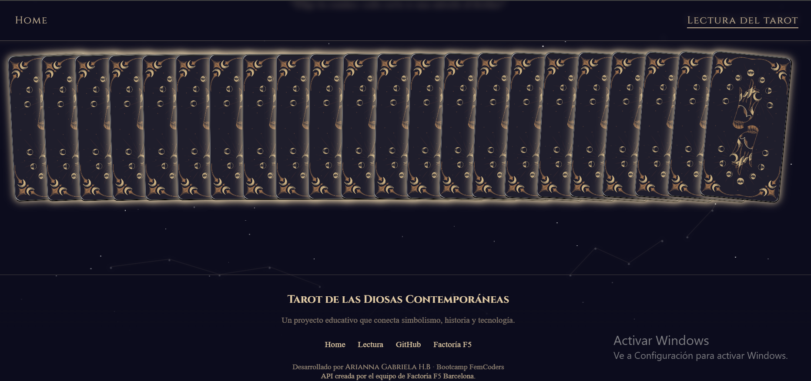
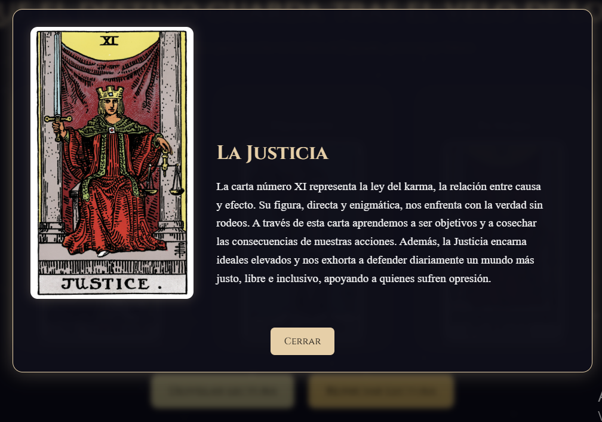

#  Arcana STEM – Un viaje entre ciencia y tarot 🔮
✨*"Explorar el universo de la ciencia a través de la magia del tarot."*✨

---

## Propósito de este proyecto 
**Arcana STEM** es una aplicación web creada con **React** que conecta el simbolismo del tarot con mujeres inspiradoras en la ciencia y la tecnología.  
Cada carta abre una ventana a su legado, permitiendo conocer tanto su significado en la lectura como su impacto en la vida real.

---
## Funcionalidad de la app 

- Al ingresar a home encontraras un **mazo digital de cartas** de los arcanos mayores del Tarot asociado con una mujer de la ciencia.  
- Explorar el **detalle de cada carta** con información completa de la diosa tecnologica, el arcano y su ilustración.  
- Pagina de **"lectura del tarot"** donde se puede realizar una **tirada de tres cartas** (Pasado, Presente, Futuro).  
- Reiniciar la tirada en cualquier momento para empezar de nuevo.  

### Lógica y estilo del mazo en la tirada:
Una carta no puede seleccionarse dos veces.
Cuando una carta es elegida, desaparece del mazo, evitando inconsistencias.
El mazo está desplegado con un diseño que imita la experiencia real de una mesa de tarot.

---
## 🌐 Demo en Vivo
[](https://arcana-stem.vercel.app/)

---

## Interfaz y pantallas principales

### Pantalla principal


### Detalle de tarjeta

[Detalle de tarjeta-responsive](src/assets/images/home-card-detail-responsive.png)

### Vista de lectura


### Mazo de lectura


### Detalle de tarjeta


--- 

## 📂 Organización del proyecto
```
src/
 ┣ 📂components/              → Componentes reutilizables y UI dinámica
 │   ┣ 📂Constellations/      → Fondo animado de constelaciones (JS + CSS)
 │   ┣ 📂ExpandableText/      → Componente para textos desplegables
 │   ┣ 📂Layout/              → Layout principal (header, footer, estructura)
 │   ┗ 📂TarotCard/           → Lógica y vista de cada carta del tarot
 │
 ┣ 📂pages/                   → Páginas completas del proyecto
 │   ┣ 📂Home/                → Pantalla inicial e introducción temática
 │   ┣ 📂CardDetail/          → Detalle completo de cada arcano
 │   ┗ 📂ReadingPage/         → Lectura de tarot (Pasado–Presente–Futuro)
 │
 ┣ 📂services/
 │   ┗ tarotServices.js       → Conexión con la API externa (Factoria F5 BCN)
 │
 ┣ 📂assets/                  → Imágenes y elementos gráficos
 │
 ┣ router.jsx                 → Rutas principales de la aplicación
 ┣ App.jsx                    → Configuración general y Layout envolvente
 ┗ main.jsx                   → Punto de entrada de React

```
---

## Tecnologías utilizadas
- **React + Vite** – framework moderno para el frontend.  
- **React Router DOM** – navegación entre pantallas.  
- **Fetch API** – consumo de datos desde la API.  
- **CSS** – estilos propios para la interfaz. 
- **JavaScript** - para animaciones y estrellas dinámicas 
- **API pública** – desarrollada por el equipo de **Factoria F5 Barcelona**.  

---

## Decisiones técnicas:

- Convención estandarizada para evitar inconsistencias y facilitar mantenimiento:

    Componentes → PascalCase
    CSS → kebab-case
    Carpetas reorganizadas por dominios lógicos (“Home”, “ReadingPage”, “CardDetail”)

- Separación clara entre lógica, vistas y servicios

    La comunicación con la API vive en services/tarotServices.js.
    Cada página tiene su propio directorio con su CSS correspondiente.

- Manejo robusto del estado en la lectura del tarot 

- Modal responsivo condicional

    En escritorio → imagen + texto.
    En móvil → solo texto para optimizar lectura.

- Transiciones suaves y UX cuidada

    La app fue diseñada para transmitir una experiencia fluida, estética e inmersiva 
    pero sin comprometer rendimiento.

---

## 🚀 Cómo ejecutar el proyecto
### Requisitos
- Tener instalado **Node.js** y **npm**.  

### Pasos para clonar el repositorio

```bash
git clone https://github.com/gabriela-her/arcana-stem
cd arcana-stem
```

### Instalar dependencias

```
npm install
```

### Levantar entorno de desarrollo

```
npm run dev
```

### Compilar para producción

```
npm run build
```

--- 

## Posibles mejoras futuras

- Entrada interactiva más mística
Crear una intro animada.
Tras la animación.

- Barajar el mazo dinámicamente
Cada vez que el usuario acceda a la lectura, las cartas aparecerán en posiciones aleatorias, imitando mejor la experiencia real.

- Transiciones de revelación más sofisticadas
Implementar un flip 3D para las cartas al ser reveladas, con animaciones suaves y brillo místico.

- Filtro/buscador de cartas
Añadir una vista general del mazo con buscador por nombre, arquetipo o área científica.

## Creditos

Proyecto desarrollado por ***Arianna Gabriela*** del Bootcamp FemCoders de Factoria F5.

## Licencia

Este proyecto tiene fines educativos y de aprendizaje.
